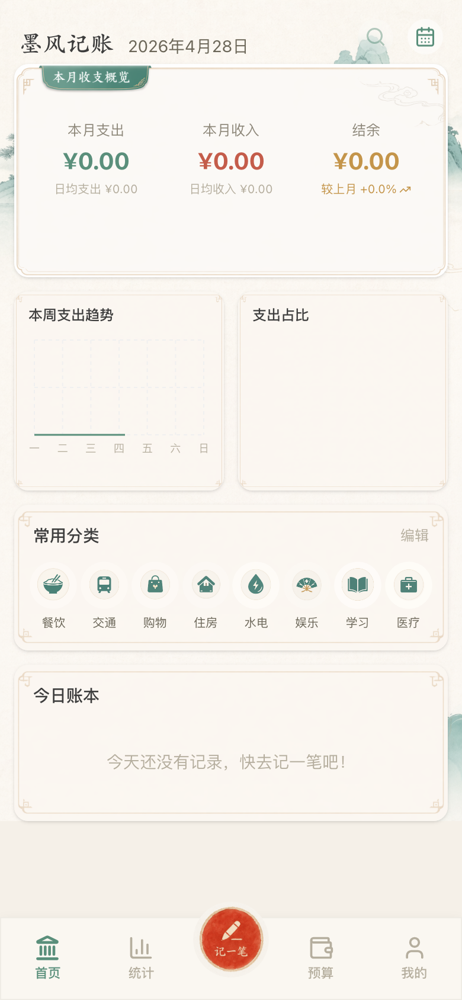
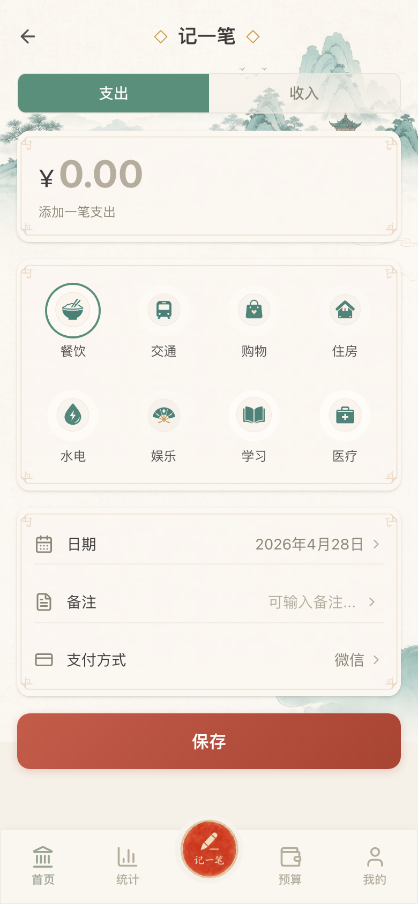
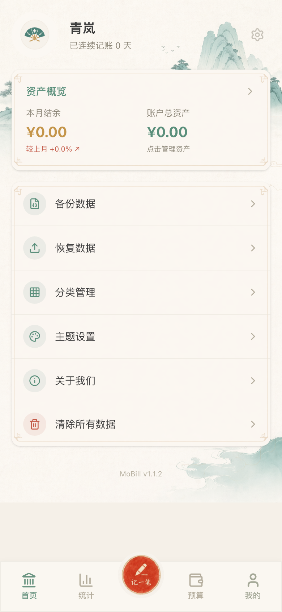

# MoBill

[](https://github.com/Cmochance/MoBill/stargazers)
[](https://github.com/Cmochance/MoBill/releases/latest)
[](https://github.com/Cmochance/MoBill/releases)
[](LICENSE)
[](https://nextjs.org/)
[](https://capacitorjs.com/)
[](https://www.typescriptlang.org/)

Simplified Chinese README: [README.md](README.md)

MoBill is a lightweight personal finance app with a Chinese ink-inspired visual style. It records daily income, expenses, categories, budgets, assets, payment methods, and notes. Data is stored locally by default and automatically mirrored to `Documents/MoBill/data.json`, so users can keep direct control of their ledger file while still using a mobile app interface.

The current project is built as a **Next.js static app wrapped by Capacitor for Android**. The web build can be used as a static preview, and the Android build can be packaged as an APK.

## Interface Preview

<table>
  <tr>
    <td width="50%">
      
    </td>
    <td width="50%">
      
    </td>
  </tr>
  <tr>
    <td align="center">Home overview, weekly trend, common categories, and today's ledger</td>
    <td align="center">Add record, category selection, date, note, and payment method</td>
  </tr>
  <tr>
    <td colspan="2">
      
    </td>
  </tr>
  <tr>
    <td colspan="2" align="center">Asset overview, backup and restore, category management, themes, and about dialog</td>
  </tr>
</table>

MoBill is not intended to be a complex accounting system. Its goal is to keep high-frequency expense recording, ledger review, and local backup clear and stable. The interface uses rice-paper backgrounds, muted ink green, cinnabar accents, ledger cards, and seal-like details.

## Download

The latest version is available from GitHub Releases:

```text
https://github.com/Cmochance/MoBill/releases/latest
```

Regular users should download the Android APK asset from the Release page. If a release does not include an APK yet, you can build it locally by following [BUILD_GUIDE.md](BUILD_GUIDE.md).

Release notes for this version are available in [CHANGELOG.md](CHANGELOG.md).

If this app is useful to you, a Star is appreciated. For issues, workflow suggestions, or platform support requests, use [Issues](https://github.com/Cmochance/MoBill/issues). You can also contact QQ `3216202644`.

## Features

- Record expenses and income with real date, time, category, amount, method, and note fields.
- View monthly expense, monthly income, balance, weekly expense trend, category breakdown, and today's ledger on the home page.
- Browse recent records by day, month, or year in a full-page record panel.
- Use weekly analysis as the default statistics view, with week, month, and year modes available.
- Manage budgets and view monthly budget progress.
- Add custom categories with preset icons or uploaded images. Uploaded icons are cropped to a standard square shape without non-uniform scaling.
- Remember the latest 10 unique non-empty notes and select them from a bottom sheet while adding a record.
- Switch between five color themes: Mo Feng, Song Yan, Zhu Sha, Yu Ci, and Xuan Qing.
- Manage asset accounts, nickname, about dialog, and update checks.
- Back up and restore data through the fixed local file `Documents/MoBill/data.json`.
- Require two confirmations before clearing all data.

## Basic Usage

1. Open the app and tap the center `记一笔` button.
2. Choose expense or income, then enter the amount.
3. Select category, date, note, and payment or income method.
4. Tap `保存`. The record is added to today's ledger and statistics immediately.
5. Use the calendar button on the home page to open the recent records panel and filter by day, month, or year.
6. Use the profile page to manage assets, categories, themes, backup, restore, and data clearing.

## Data And Backup

The app maintains two local data stores:

- Internal app data: Capacitor Preferences first, with `localStorage` compatibility for web preview.
- Local data file: `Documents/MoBill/data.json`.

After every saved record, category, budget, or settings change, the full app payload is written to `Documents/MoBill/data.json`. On startup, the app compares internal data with that file:

- If they match, the app starts normally.
- If they differ, the app asks whether to import local file data.
- If the user imports file data, internal app data is first backed up to `Documents/MoBill/backup-YYYY-MM-DD-HHmmss.json`, then `data.json` overwrites internal data.
- If the user keeps app data, the current `data.json` is backed up first, then app data overwrites the file.

Manual backup and restore use the same backup-before-overwrite logic. `data.json` and backup files may contain the full ledger, categories, assets, themes, and note history. Store them only on trusted devices.

## Local Development

Install dependencies:

```bash
npm install
```

Start the dev server:

```bash
npm run dev
```

Open:

```text
http://localhost:3000
```

Common validation commands:

```bash
npm run lint
npm run typecheck
npm run build
npm run check
```

`npm run build` runs the Next.js static export and writes output to `dist/`.

## Android Packaging

The project uses Capacitor to sync the static site into the Android project:

```bash
npm run build
npm run sync:android
```

For Debug APK, Release APK, local JDK/Android SDK setup, signing files, and one-click scripts, see [BUILD_GUIDE.md](BUILD_GUIDE.md).

The repository keeps source code, Android project source, build scripts, and example configuration. `dist/`, `*.apk`, `*.aab`, local toolchains, and real signing files are kept out of Git.

## Troubleshooting

### The App Opens With Empty Data

First check whether you changed browser, device, or install package. On startup, MoBill reads both internal storage and `Documents/MoBill/data.json`. If they differ, choose whether to import local file data or keep app data in the prompt.

### Backup Or Restore Fails

Make sure the app can write to `Documents/MoBill/`. On Android, system file restrictions can cause backup or restore failures. Check app permissions or reinstall and try again.

### Update Check Fails

The about dialog reads GitHub Release information. If the current network cannot access GitHub, or GitHub API returns an error, update checking fails. You can open the Release page directly:

```text
https://github.com/Cmochance/MoBill/releases
```

### Android Blocks APK Installation

Android blocks APK files from unknown sources by default. Only download APKs from this repository's Release page, and allow the current browser or file manager to install unknown apps if you trust the package.

### APK Build Fails

Run:

```bash
npm run check
```

If frontend checks pass, follow [BUILD_GUIDE.md](BUILD_GUIDE.md) to verify JDK, Android SDK, Gradle Wrapper, and signing configuration. Real keys and passwords should stay local and must not be committed.

## Tech Stack

- Frontend: Next.js 16, React 19, TypeScript
- Styling: Tailwind CSS 4, global CSS variables for themes
- Charts: Recharts
- Dates: date-fns
- Icons: lucide-react
- Native capabilities: Capacitor Preferences, Capacitor Filesystem
- Android wrapper: Capacitor Android

## Project Structure

```text
src/app/                 Next.js app entry and global styles
src/components/          Home, add record, stats, budget, and profile views
src/components/profile/  Category management, theme settings, assets, and about dialog
src/lib/                 Data, storage, sorting, themes, and app metadata
public/                  Runtime static assets
docs/assets/             Source design assets, not imported by runtime code
android/                 Capacitor Android project source
BUILD_GUIDE.md           Android build and signing guide
```

## Security

- MoBill is a personal ledger app. It does not provide investment, accounting, or financial advice.
- Data is stored locally by default. When exporting, backing up, or syncing files, verify that the target location is trusted.
- `Documents/MoBill/data.json` and `backup-*.json` may contain full personal ledger data. Do not upload them to public repositories or untrusted cloud drives.

## Acknowledgements

The README structure follows the release-oriented style of [Codex Account Switch](https://github.com/Cmochance/Codex_Account_Switch), then adapts it for MoBill's mobile ledger workflow.

## License

MIT License. See [LICENSE](LICENSE) for the full text.
