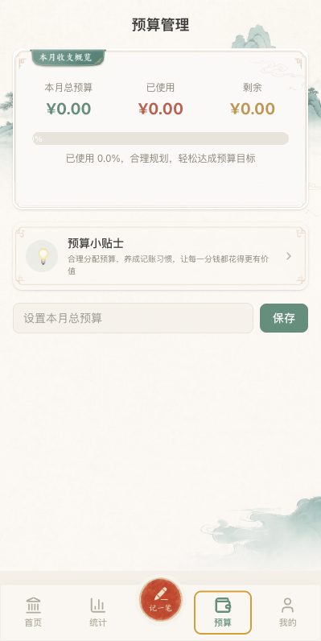
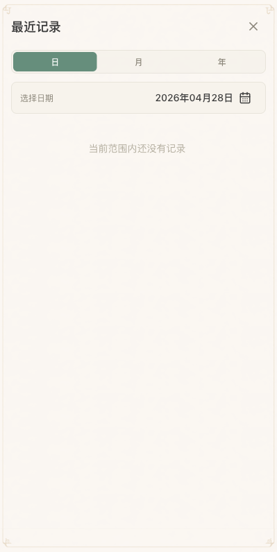

# 墨风记账 MoBill

[](https://github.com/Cmochance/MoBill/stargazers)
[](https://github.com/Cmochance/MoBill/releases/latest)
[](https://github.com/Cmochance/MoBill/releases)
[](LICENSE)
[](https://nextjs.org/)
[](https://capacitorjs.com/)
[](https://www.typescriptlang.org/)

English README: [README-en.md](README-en.md)

墨风记账是一款偏国风视觉的轻量个人记账应用，用来记录日常收入、支出、分类、预算和资产信息。它默认把数据保存在本机，可以通过第三方云同步平台对数据进行多端同步，数据文件为 `Documents/MoBill/data.json`，适合希望掌控自己账本文件、又需要移动端体验的用户。

本项目当前以 **Next.js 静态应用 + Capacitor Android 封装** 为主，目前只支持 Android 端，若有好的建议或是 IOS 端适配，欢迎提交 PR。

## 界面与定位

<table>
  <tr>
    <td width="33%">
      
    </td>
    <td width="33%">
      
    </td>
    <td width="33%">
      
    </td>
  </tr>
  <tr>
    <td align="center">首页</td>
    <td align="center">统计</td>
    <td align="center">记一笔</td>
  </tr>
  <tr>
    <td width="33%">
      
    </td>
    <td width="33%">
      
    </td>
    <td width="33%">
      
    </td>
  </tr>
  <tr>
    <td align="center">预算</td>
    <td align="center">我的</td>
    <td align="center">最近记录</td>
  </tr>
</table>

墨风记账的设计目标不是做复杂财务系统，而是把高频记账、账本回看和本机备份做得稳定、清楚、少打扰。界面以宣纸底色、松烟墨绿和朱砂点色为主，保留账本、印章和纸张边框的视觉感。

## 下载

最新版本以 GitHub Release 为准：

```text
https://github.com/Cmochance/MoBill/releases/latest
```

普通用户优先下载 Release 页面中的 Android APK 资产。若某个版本暂未提供 APK，可以按 [构建与部署指南](BUILD_GUIDE.md) 在本机打包。

本次发布的版本更新说明见 [CHANGELOG.md](CHANGELOG.md)。

如果这个应用对你有帮助，欢迎 Star 一下。遇到问题、希望补充记账流程或需要新的平台适配，可以发到 [Issues](https://github.com/Cmochance/MoBill/issues)，也可以通过 QQ `3216202644` 联系。

## 能做什么

- 记录支出和收入，保存真实日期、时间、分类、金额、方式和备注。
- 首页展示本月支出、本月收入、结余、本周支出趋势、支出占比和今日账本。
- 最近记录支持按日、月、年查看，并可在完整记录面板中切换时间范围。
- 统计页默认进入周分析，提供周、月、年维度的支出统计。
- 支持预算管理，用于记录月度预算和查看预算进度。
- 支持分类管理，可以新增分类名称和图标；图标可选预设，也可上传图片并自动裁剪成标准比例。
- 支持备注记忆，自动保存最近 10 条非重复备注，记账时可从底部弹层快速选择。
- 支持五套主题配色：墨风、松烟、朱砂、雨瓷、玄青。
- 支持资产账户记录、昵称设置、关于我们和版本更新检测。
- 支持本机备份与恢复，固定数据文件为 `Documents/MoBill/data.json`。
- 清除所有数据需要两次确认，避免误操作。

## 基本用法

1. 打开应用，点击底部中间的“记一笔”。
2. 选择支出或收入，输入金额。
3. 选择分类、日期、备注和支付或入账方式。
4. 点击“保存”，记录会立即进入今日账本和统计数据。
5. 首页右上角日历按钮可打开最近记录面板，按日、月、年筛选历史账本。
6. 在“我的”页面可以管理资产、分类、主题，以及执行备份、恢复和清除数据。

## 数据与备份

应用会维护两份本机数据：

- 应用内部数据：优先使用 Capacitor Preferences，网页预览时兼容 `localStorage`。
- 本机数据文件：`Documents/MoBill/data.json`。

每次保存记账、分类、预算或设置后，应用会自动把完整数据写入 `Documents/MoBill/data.json`。应用启动时会比较内部数据和该文件：

- 如果两边一致，直接进入应用。
- 如果两边不一致，会提示是否导入本机数据。
- 选择导入时，会先把应用内数据备份为 `Documents/MoBill/backup-YYYY-MM-DD-HHmmss.json`，再用 `data.json` 覆盖应用内数据。
- 选择不导入时，会先备份现有 `data.json`，再用应用内数据覆盖该文件。

手动“备份数据”和“恢复数据”使用同一套覆盖前备份逻辑。`data.json` 和备份文件都可能包含完整账本、分类、资产、主题和备注历史，请只保存在可信设备上。

## 本地开发

安装依赖：

```bash
npm install
```

启动开发服务器：

```bash
npm run dev
```

访问：

```text
http://localhost:3000
```

常用检查命令：

```bash
npm run lint
npm run typecheck
npm run build
npm run check
```

其中 `npm run build` 会执行 Next.js 静态导出，产物目录为 `dist/`。

## Android 打包

项目使用 Capacitor 将静态站点同步到 Android 工程：

```bash
npm run build
npm run sync:android
```

Debug APK、Release APK、本机 JDK/Android SDK、签名文件和一键脚本的详细说明见 [BUILD_GUIDE.md](BUILD_GUIDE.md)。

仓库只保存源码、Android 工程源码、构建脚本和示例配置；`dist/`、`*.apk`、`*.aab`、本机工具链和真实签名文件不进入 Git。

## Troubleshooting

### 页面打开后数据为空

请先确认是否刚换了浏览器、设备或安装包。应用启动时会从内部存储和 `Documents/MoBill/data.json` 读取数据。如果两边不一致，应按弹窗提示选择导入本机数据或保留应用内数据。

### 备份或恢复失败

请确认应用有访问 `Documents/MoBill/` 的权限。Android 上如果系统限制文件写入，备份和恢复会提示失败，需要检查应用权限或重新安装后再试。

### 版本更新检测失败

关于我们页面会读取 GitHub Release 信息。如果当前网络无法访问 GitHub，或者 GitHub API 返回异常，应用会显示检测失败。此时可直接访问 Release 页面确认是否有新版本：

```text
https://github.com/Cmochance/MoBill/releases
```

### 安装 APK 时提示未知来源

Android 默认会拦截非应用商店安装包。请只从本仓库 Release 页面下载 APK，并按系统提示允许当前文件管理器或浏览器安装未知来源应用。

### 构建 APK 失败

请先运行：

```bash
npm run check
```

如果前端检查通过，再按 [BUILD_GUIDE.md](BUILD_GUIDE.md) 检查 JDK、Android SDK、Gradle Wrapper 和签名配置。真实密钥和口令只应放在本机，不要提交到仓库。

## 技术栈

- 前端框架：Next.js 16, React 19, TypeScript
- 样式方案：Tailwind CSS 4, 全局 CSS 变量主题
- 图表：Recharts
- 日期处理：date-fns
- 图标：lucide-react
- 本机能力：Capacitor Preferences, Capacitor Filesystem
- Android 封装：Capacitor Android

## 项目结构

```text
src/app/                 Next.js 应用入口和全局样式
src/components/          首页、记账、统计、预算、我的等界面组件
src/components/profile/  分类管理、主题设置、资产管理、关于我们
src/lib/                 数据、存储、记录排序、主题、版本信息等业务逻辑
public/                  运行时静态资源
docs/assets/             设计原稿，不被代码直接引用
android/                 Capacitor Android 工程源码
BUILD_GUIDE.md           Android 构建与签名说明
```

## 安全说明

- 本项目是个人记账工具，不提供投资、理财或会计建议。
- 数据默认保存在本机，导出、备份或同步文件时请自行确认保存位置可信。
- `Documents/MoBill/data.json` 和 `backup-*.json` 可能包含完整个人账本数据，不建议上传到公开仓库或不可信网盘。

## 致谢

README 结构参考了同作者项目 [Codex Account Switch](https://github.com/Cmochance/Codex_Account_Switch) 的发布说明风格，并根据 MoBill 的移动端记账场景重新整理。

## 许可证

MIT License。完整文本见 [LICENSE](LICENSE)。
